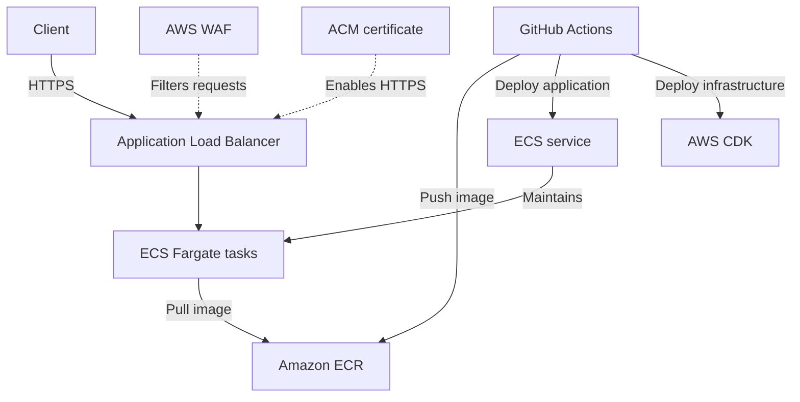

# Shipyard

Shipyard is a learning project that demonstrates how to build, publish, and deploy a containerized Node.js application to AWS using infrastructure as code and CI/CD.

## Architecture

```mermaid
flowchart TD
    Client["Client"] -->|HTTPS| ALB["Application Load Balancer"]
    WAF["AWS WAF"] -.->|Filters requests| ALB
    ACM["ACM certificate"] -.->|Enables HTTPS| ALB
    ALB --> Tasks["ECS Fargate tasks"]

    GitHub["GitHub Actions"] -->|Push image| ECR["Amazon ECR"]
    GitHub -->|Deploy application| Service["ECS service"]
    Service -->|Maintains| Tasks
    Tasks -->|Pull image| ECR
    GitHub -->|Deploy infrastructure| CDK["AWS CDK"]
```
